# Enterprise Value to EBITDA Ratio Prediction
A traditional measure of whether a stock is expensive or cheap, is to use a valuation multiple. A valuation multiple relates the market value of an asset relative to a key statistic that is assumed to relate to that value. To be useful, that statistic – whether earnings, cash flow or some other measure – must bear a logical relationship to the market value observed; to be seen, in fact, as the driver of that market value. For more information about valuation multiples, refer to below link: <https://en.wikipedia.org/wiki/Valuation_using_multiples#Valuation_multiples>


## 1. Enterprise Value to EBITDA ratio
One of the most widely used enterprise value multiples is the Enterprise Value to Ebitda (Earnings before interest, taxes, depreciation and amortization) multiple, short EV/Ebitda.

This is the ratio between the Enterprise Value of a company, meaning the total sum of the market value of the equity and net debt, divided by the company’s Ebitda.<br>
In this project we will try to predict the EV/Ebitda ratios for the 3000 biggest companies listed on the US stock exchanges.

Before analysing our dataset, let us first try to understand what fundamental financial information about the company should be driving the EV/Ebitda ratio based on Financial Theory.

The present value of any Cash Flow generating asset is the value of all future cash flows the asset will generate over its lifetime, discounted back to today with a risk adjusted interest rate.

In its simplest form, where we expect the cash flow (CF) to grow at the same rate for ever (g), the present value (PV) is calculated with below perpetuity formula.

$PV = \frac{CF * (1+g)}{(r-g)}$

When trying to value a company based on its future cash flows, we can either look at it through the lenses of all capital providers (equity and debt providers) and we would use the FCFF (Free Cash Flow to the Firm) as the measure of cash flow (CF), or we could look at it purely as an Equity investor and we would use the FCFE (Free Cash Flow to Equity) as our measure of CF.

The main difference is that the FCFF is the cash flow left over after cash flow needs for operations and Investments are met, but before any debt repayments, whereas the FCFE is after debt payments (cash flow left over for equity investors).

If we want to estimate the value of total Firm directly, we would therefore use the FCFF as the appropriate measure of CF.

As the Enterprise Value (EV) (numerator in the EV/Ebitda ratio), is the aggregate market estimation of the value of the total firm (Equity + debt), we can rewrite the above formula as follows:

$EV = \frac{FCFF*(1 + g)}{(r - g)}$<br><br>

FCFF can be rewritten as:<br><br>

$EV = \frac{(EBITDA-Taxes-CAPEX-deltaWC)*(1 + g)}{(r - g)}$<br><br>


Re-writing the numerator relative to EBITDA gives us:<br><br>

$EV = \frac{EBITDA*(1-\frac{Taxes}{EBITDA}-\frac{CAPEX}{EBITDA}-\frac{deltaWC}{EBITDA})*(1 + g)}{(r - g)}$<br>

$EV = \frac{EBITDA*(1-\frac{Taxes}{EBITDA}- \frac{CAPEX + deltaWC}{EBITDA})*(1 + g)}{(r - g)}$<br>

$EV = \frac{EBITDA*(1-\frac{Taxes}{EBITDA}- \frac{reinvestment}{EBITDA})*(1 + g)}{(r - g)}$<br><br>

Deviding both sides by the EBITDA, gives us the EV to EBITDA ratio:<br><br>
$\frac{EV}{EBITDA}= \frac{\frac{EBITDA*(1-\frac{Taxes}{EBITDA}- \frac{reinvestment}{EBITDA})*(1 + g)}{(r - g)}}{EBITDA}$<br>

$\frac{EV}{EBITDA} = \frac{(1-\frac{Taxes}{EBITDA}- \frac{reinvestment}{EBITDA})*(1 + g)}{(r - g)}$<br><br>

Finally converting the discount rate r to the cost of capital gives us:<br><br>
$\frac{EV}{EBITDA} = \frac{(1-\frac{Taxes}{EBITDA}- \frac{reinvestment}{EBITDA})*(1 + g)}{(WACC - g)}$<br><br>

This formula gives us some understanding of what we would expect the fundamental drivers of the EV/Ebitda ratio to be.
The fundamental drivers of the EV/EBITDA ratio are
1. A higher expected growth rate g, all else being equal, should lead to a higher EV/EBITDA 
2. A lower reinvestment need, all else being equal, should lead to a higher EV/EBITDA
3. A lower amount of Taxes, all else being equal, should lead to a higher EV/EBITDA
4. A lower amount of risk measured by the WACC, all else being equal, should result in a higher EV/EBITDA

We will therefore try to obtain financial metrics that are related to points 1-4, as we would expect these to be partial drivers of the EV/EBITDA ratios seeen in the market.

## 2. Data Extraction and Pre-Processing
The company data was downloaded from the data provider "Finbox".
For more information, refer to below link:
<https://finbox.com>

We will first import the data and check for any missing values and some basic information.
Then we will remove outliers before splitting the data into training and testing sets, and analysing the training set in more detail.


```python
# linear algebra
import numpy as np     

# data processing
import pandas as pd    
#display max columns and rows, to be able to inspect big data tables
pd.set_option('display.max_columns', None)
pd.set_option('display.max_rows', None)

#data visualization
import matplotlib.pyplot as plt
import seaborn as sns
sns.set_theme()
```


```python
# conntects to google drive if ran in colab
# ignored if ran outside of colab

if 'google.colab' in str(get_ipython()):
  from google.colab import drive
  drive.mount('/content/drive')
```

    Drive already mounted at /content/drive; to attempt to forcibly remount, call drive.mount("/content/drive", force_remount=True).
    


```python
# load file from google drive path, if ran in colab 
# load file from notebook folder, if ran outside colab

if 'google.colab' in str(get_ipython()):
    path = '/content/drive/My Drive/Colab Notebooks/stock_pricing/'
else:
    path = str()
file = path + 'large_Financials_unlinked.xlsm'

company_data = pd.read_excel(file)
```


```python
#original data structure
company_data.head(5)
```


<div>
<style scoped>
    .dataframe tbody tr th:only-of-type {
        vertical-align: middle;
    }

    .dataframe tbody tr th {
        vertical-align: top;
    }

    .dataframe thead th {
        text-align: right;
    }
</style>
<table border="1" class="dataframe">
  <thead>
    <tr style="text-align: right;">
      <th></th>
      <th>Ticker</th>
      <th>Full_Ticker</th>
      <th>Name</th>
      <th>Sector</th>
      <th>Industry_GICS</th>
      <th>Index_Membership</th>
      <th>Market_Cap</th>
      <th>Net_Debt</th>
      <th>Minority_Interest</th>
      <th>EV</th>
      <th>EBITDA</th>
      <th>Net_Income</th>
      <th>Equity</th>
      <th>Avg_EBITDA_Margin_Forecast_10y</th>
      <th>EBITDA_Forecast_CAGR_10y</th>
      <th>Avg_Net_Income_Margin_Forecast_10y</th>
      <th>Net_Income_Forecast_CAGR_10y</th>
      <th>ROE</th>
      <th>Beta_5y</th>
      <th>Net_Debt_perc_EV</th>
      <th>EV_TTM_EBITDA</th>
      <th>Market_Cap_TTM_Net_Income</th>
      <th>Market_Cap_BV_Equity</th>
      <th>Net_Debt_perc_Market_Cap</th>
    </tr>
  </thead>
  <tbody>
    <tr>
      <th>0</th>
      <td>AAPL</td>
      <td>NASDAQGS:AAPL</td>
      <td>Apple Inc.</td>
      <td>Information Technology</td>
      <td>Technology Hardware, Storage &amp; Peripherals</td>
      <td>Dow Jones Composite Average, Dow Jones Industr...</td>
      <td>2.166836e+06</td>
      <td>-69552.0</td>
      <td>0.0</td>
      <td>2.097284e+06</td>
      <td>77344.0</td>
      <td>57411.0</td>
      <td>65339.0</td>
      <td>0.28493</td>
      <td>0.0381633</td>
      <td>0.206377</td>
      <td>0.0348267</td>
      <td>0.736856</td>
      <td>1.283613</td>
      <td>-0.033163</td>
      <td>27.116315</td>
      <td>37.742528</td>
      <td>33.162985</td>
      <td>-0.032098</td>
    </tr>
    <tr>
      <th>1</th>
      <td>AMZN</td>
      <td>NASDAQGS:AMZN</td>
      <td>Amazon.com, Inc.</td>
      <td>Consumer Discretionary</td>
      <td>Internet &amp; Direct Marketing Retail</td>
      <td>Nasdaq 100, Nasdaq Composite, Russell 1000, Ru...</td>
      <td>1.565880e+06</td>
      <td>28412.0</td>
      <td>0.0</td>
      <td>1.594292e+06</td>
      <td>43708.0</td>
      <td>17377.0</td>
      <td>82775.0</td>
      <td>0.183412</td>
      <td>0.145604</td>
      <td>0.0865852</td>
      <td>0.201361</td>
      <td>0.249521</td>
      <td>1.198004</td>
      <td>0.017821</td>
      <td>36.475980</td>
      <td>90.112226</td>
      <td>18.917308</td>
      <td>0.018144</td>
    </tr>
    <tr>
      <th>2</th>
      <td>MSFT</td>
      <td>NASDAQGS:MSFT</td>
      <td>Microsoft Corporation</td>
      <td>Information Technology</td>
      <td>Software</td>
      <td>Dow Jones Composite Average, Dow Jones Industr...</td>
      <td>1.624977e+06</td>
      <td>-54733.0</td>
      <td>0.0</td>
      <td>1.570244e+06</td>
      <td>68123.0</td>
      <td>47496.0</td>
      <td>123392.0</td>
      <td>0.475806</td>
      <td>0.0485504</td>
      <td>0.324014</td>
      <td>0.048353</td>
      <td>0.413993</td>
      <td>0.826155</td>
      <td>-0.034856</td>
      <td>23.050136</td>
      <td>34.212932</td>
      <td>13.169228</td>
      <td>-0.033682</td>
    </tr>
    <tr>
      <th>3</th>
      <td>GOOG</td>
      <td>NASDAQGS:GOOG</td>
      <td>Alphabet Inc.</td>
      <td>Communication Services</td>
      <td>Interactive Media &amp; Services</td>
      <td>Nasdaq 100, Nasdaq Composite, Russell 1000, Ru...</td>
      <td>1.178252e+06</td>
      <td>-105501.0</td>
      <td>0.0</td>
      <td>1.072751e+06</td>
      <td>48075.0</td>
      <td>35713.0</td>
      <td>212920.0</td>
      <td>0.381029</td>
      <td>0.107043</td>
      <td>0.260145</td>
      <td>0.110387</td>
      <td>0.175111</td>
      <td>0.994747</td>
      <td>-0.098346</td>
      <td>22.314107</td>
      <td>32.992235</td>
      <td>5.533776</td>
      <td>-0.089540</td>
    </tr>
    <tr>
      <th>4</th>
      <td>FB</td>
      <td>NASDAQGS:FB</td>
      <td>Facebook, Inc.</td>
      <td>Communication Services</td>
      <td>Interactive Media &amp; Services</td>
      <td>Nasdaq 100, Nasdaq Composite, Russell 1000, Ru...</td>
      <td>7.151778e+05</td>
      <td>-44476.0</td>
      <td>0.0</td>
      <td>6.707018e+05</td>
      <td>30221.0</td>
      <td>25276.0</td>
      <td>117731.0</td>
      <td>0.530226</td>
      <td>0.119821</td>
      <td>0.351485</td>
      <td>0.131987</td>
      <td>0.238757</td>
      <td>1.182773</td>
      <td>-0.066313</td>
      <td>22.193237</td>
      <td>28.294738</td>
      <td>6.074677</td>
      <td>-0.062189</td>
    </tr>
  </tbody>
</table>
</div>


### 2.1 Data Structure and removal of not meaningful samples


```python
#original data shape
original_data_shape = company_data.shape
print('The original data shape is', original_data_shape)
```

    The original data shape is (3171, 24)
    


```python
#drop duplicates
company_data = company_data.drop_duplicates('Name' , keep='first')
print(original_data_shape[0] - company_data.shape[0], 'companies were removed due to duplication.')
print('The new data shape is', company_data.shape)
```

    21 companies were removed due to duplication.
    The new data shape is (3150, 24)
    


```python
#remove not meaningful samples
current_num_samples = company_data.shape[0]
company_data = company_data[(company_data.EV > 0)]
company_data = company_data[(company_data.Market_Cap > 0)]
company_data = company_data[(company_data.EBITDA > 0)]
company_data = company_data[(company_data.Sector != 'Financials')]
new_num_samples = company_data.shape[0]
print(current_num_samples - new_num_samples, 'companies were removed due to not meaningful data.')
print('The new data shape is', company_data.shape)
```

    1281 companies were removed due to not meaningful data.
    The new data shape is (1869, 24)
    


```python
#filter data for required columns
data = company_data[['Sector', 
                        'Name', 
                        'EV_TTM_EBITDA', 
                        'EBITDA_Forecast_CAGR_10y',
                        'Avg_EBITDA_Margin_Forecast_10y', 
                        'Beta_5y', 
                        'Net_Debt_perc_Market_Cap'
                       ]].set_index('Name')
data.head(5)
```


<div>
<style scoped>
    .dataframe tbody tr th:only-of-type {
        vertical-align: middle;
    }

    .dataframe tbody tr th {
        vertical-align: top;
    }

    .dataframe thead th {
        text-align: right;
    }
</style>
<table border="1" class="dataframe">
  <thead>
    <tr style="text-align: right;">
      <th></th>
      <th>Sector</th>
      <th>EV_TTM_EBITDA</th>
      <th>EBITDA_Forecast_CAGR_10y</th>
      <th>Avg_EBITDA_Margin_Forecast_10y</th>
      <th>Beta_5y</th>
      <th>Net_Debt_perc_Market_Cap</th>
    </tr>
    <tr>
      <th>Name</th>
      <th></th>
      <th></th>
      <th></th>
      <th></th>
      <th></th>
      <th></th>
    </tr>
  </thead>
  <tbody>
    <tr>
      <th>Apple Inc.</th>
      <td>Information Technology</td>
      <td>27.116315</td>
      <td>0.0381633</td>
      <td>0.28493</td>
      <td>1.283613</td>
      <td>-0.032098</td>
    </tr>
    <tr>
      <th>Amazon.com, Inc.</th>
      <td>Consumer Discretionary</td>
      <td>36.475980</td>
      <td>0.145604</td>
      <td>0.183412</td>
      <td>1.198004</td>
      <td>0.018144</td>
    </tr>
    <tr>
      <th>Microsoft Corporation</th>
      <td>Information Technology</td>
      <td>23.050136</td>
      <td>0.0485504</td>
      <td>0.475806</td>
      <td>0.826155</td>
      <td>-0.033682</td>
    </tr>
    <tr>
      <th>Alphabet Inc.</th>
      <td>Communication Services</td>
      <td>22.314107</td>
      <td>0.107043</td>
      <td>0.381029</td>
      <td>0.994747</td>
      <td>-0.089540</td>
    </tr>
    <tr>
      <th>Facebook, Inc.</th>
      <td>Communication Services</td>
      <td>22.193237</td>
      <td>0.119821</td>
      <td>0.530226</td>
      <td>1.182773</td>
      <td>-0.062189</td>
    </tr>
  </tbody>
</table>
</div>


```python
#check column data types
data.info()
```

    <class 'pandas.core.frame.DataFrame'>
    Index: 1869 entries, Apple Inc. to Sequential Brands Group, Inc.
    Data columns (total 6 columns):
     #   Column                          Non-Null Count  Dtype  
    ---  ------                          --------------  -----  
     0   Sector                          1869 non-null   object 
     1   EV_TTM_EBITDA                   1869 non-null   float64
     2   EBITDA_Forecast_CAGR_10y        1869 non-null   object 
     3   Avg_EBITDA_Margin_Forecast_10y  1869 non-null   object 
     4   Beta_5y                         1869 non-null   float64
     5   Net_Debt_perc_Market_Cap        1869 non-null   float64
    dtypes: float64(3), object(3)
    memory usage: 102.2+ KB
    


```python
#ensure columns have the correct data type
data['EV_TTM_EBITDA'] = data['EV_TTM_EBITDA'].apply(pd.to_numeric, errors='coerce')
data['EBITDA_Forecast_CAGR_10y'] = data['EBITDA_Forecast_CAGR_10y'].apply(pd.to_numeric, errors='coerce')
data['Avg_EBITDA_Margin_Forecast_10y'] = data['Avg_EBITDA_Margin_Forecast_10y'].apply(pd.to_numeric, errors='coerce')
data['Beta_5y'] = data['Beta_5y'].apply(pd.to_numeric, errors='coerce')
data['Net_Debt_perc_Market_Cap'] = data['Net_Debt_perc_Market_Cap'].apply(pd.to_numeric, errors='coerce')
```


```python
data.info()
```

    <class 'pandas.core.frame.DataFrame'>
    Index: 1869 entries, Apple Inc. to Sequential Brands Group, Inc.
    Data columns (total 6 columns):
     #   Column                          Non-Null Count  Dtype  
    ---  ------                          --------------  -----  
     0   Sector                          1869 non-null   object 
     1   EV_TTM_EBITDA                   1869 non-null   float64
     2   EBITDA_Forecast_CAGR_10y        1811 non-null   float64
     3   Avg_EBITDA_Margin_Forecast_10y  1864 non-null   float64
     4   Beta_5y                         1869 non-null   float64
     5   Net_Debt_perc_Market_Cap        1869 non-null   float64
    dtypes: float64(5), object(1)
    memory usage: 102.2+ KB
    


```python
#check for missing values
data.isna().sum()
```


    Sector                             0
    EV_TTM_EBITDA                      0
    EBITDA_Forecast_CAGR_10y          58
    Avg_EBITDA_Margin_Forecast_10y     5
    Beta_5y                            0
    Net_Debt_perc_Market_Cap           0
    dtype: int64


```python
#remove missing values
current_num_samples = data.shape[0]
data = data.dropna()
data.isna().sum()
new_num_samples = data.shape[0]
print(current_num_samples - new_num_samples, 'companies were removed due to missing data.')
print('The new data shape is', data.shape)
```

    58 companies were removed due to missing data.
    The new data shape is (1811, 6)
    

### 2.2 Inspection for Outliers
We will look at the individual histograms of all variables, to see if we have potential outliers, and use Gaussian mixture models to later remove these outliers.

### 2.2.1 Summary Statistics and Histograms


```python
#summary statistics before outlier removal
data.describe()
```


<div>
<style scoped>
    .dataframe tbody tr th:only-of-type {
        vertical-align: middle;
    }

    .dataframe tbody tr th {
        vertical-align: top;
    }

    .dataframe thead th {
        text-align: right;
    }
</style>
<table border="1" class="dataframe">
  <thead>
    <tr style="text-align: right;">
      <th></th>
      <th>EV_TTM_EBITDA</th>
      <th>EBITDA_Forecast_CAGR_10y</th>
      <th>Avg_EBITDA_Margin_Forecast_10y</th>
      <th>Beta_5y</th>
      <th>Net_Debt_perc_Market_Cap</th>
    </tr>
  </thead>
  <tbody>
    <tr>
      <th>count</th>
      <td>1811.000000</td>
      <td>1811.000000</td>
      <td>1811.000000</td>
      <td>1811.000000</td>
      <td>1811.000000</td>
    </tr>
    <tr>
      <th>mean</th>
      <td>42.875328</td>
      <td>0.062582</td>
      <td>0.266711</td>
      <td>1.650814</td>
      <td>0.525916</td>
    </tr>
    <tr>
      <th>std</th>
      <td>314.195939</td>
      <td>0.083894</td>
      <td>0.182540</td>
      <td>16.772324</td>
      <td>1.345549</td>
    </tr>
    <tr>
      <th>min</th>
      <td>0.542898</td>
      <td>-0.290873</td>
      <td>0.000000</td>
      <td>-6.314600</td>
      <td>-1.025617</td>
    </tr>
    <tr>
      <th>25%</th>
      <td>10.680256</td>
      <td>0.023840</td>
      <td>0.130704</td>
      <td>0.793330</td>
      <td>0.016698</td>
    </tr>
    <tr>
      <th>50%</th>
      <td>15.715954</td>
      <td>0.042193</td>
      <td>0.213080</td>
      <td>1.182805</td>
      <td>0.202935</td>
    </tr>
    <tr>
      <th>75%</th>
      <td>24.875574</td>
      <td>0.079265</td>
      <td>0.360770</td>
      <td>1.607668</td>
      <td>0.592843</td>
    </tr>
    <tr>
      <th>max</th>
      <td>10586.768907</td>
      <td>1.201920</td>
      <td>0.844657</td>
      <td>714.265241</td>
      <td>25.971131</td>
    </tr>
  </tbody>
</table>
</div>


```python
sns.histplot(data[['EV_TTM_EBITDA']])
```


    <matplotlib.axes._subplots.AxesSubplot at 0x7fab9fb889b0>


    
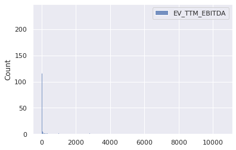
    


```python
sns.histplot(np.log(data[['EV_TTM_EBITDA']]))
```


    <matplotlib.axes._subplots.AxesSubplot at 0x7fab8b362ac8>


    
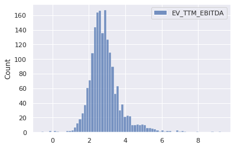
    


```python
sns.histplot(data[['EBITDA_Forecast_CAGR_10y']])
```


    <matplotlib.axes._subplots.AxesSubplot at 0x7fab8b329320>


    
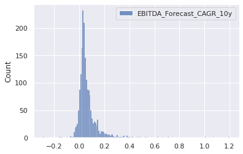
    


```python
sns.histplot(data[['Avg_EBITDA_Margin_Forecast_10y']])
```


    <matplotlib.axes._subplots.AxesSubplot at 0x7fab8ac92208>


    
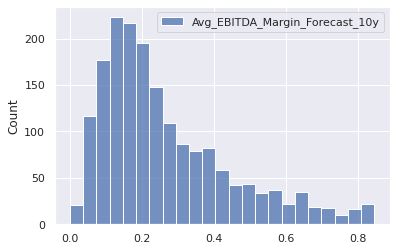
    


```python
sns.histplot(data[['Beta_5y']])
```


    <matplotlib.axes._subplots.AxesSubplot at 0x7fab8af04550>


    
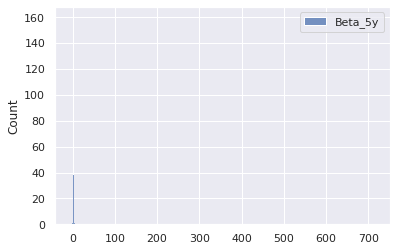
    


```python
sns.histplot(data[['Net_Debt_perc_Market_Cap']])
```


    <matplotlib.axes._subplots.AxesSubplot at 0x7fab879eca90>


    
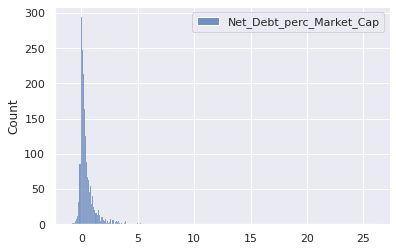
    


### 2.2.2 Outlier Removal with Gaussian Mixtures


```python
#check for outliers with multivariate Guassian
from sklearn.covariance import EllipticEnvelope

X = data[['EV_TTM_EBITDA', 
             'EBITDA_Forecast_CAGR_10y',
             'Avg_EBITDA_Margin_Forecast_10y',
             'Beta_5y',
             'Net_Debt_perc_Market_Cap']]
cov = EllipticEnvelope(random_state=0, contamination=0.1).fit(X)
# predict returns 1 for an inlier and -1 for an outlier
data[cov.predict(X)== -1]
```


<div>
<style scoped>
    .dataframe tbody tr th:only-of-type {
        vertical-align: middle;
    }

    .dataframe tbody tr th {
        vertical-align: top;
    }

    .dataframe thead th {
        text-align: right;
    }
</style>
<table border="1" class="dataframe">
  <thead>
    <tr style="text-align: right;">
      <th></th>
      <th>Sector</th>
      <th>EV_TTM_EBITDA</th>
      <th>EBITDA_Forecast_CAGR_10y</th>
      <th>Avg_EBITDA_Margin_Forecast_10y</th>
      <th>Beta_5y</th>
      <th>Net_Debt_perc_Market_Cap</th>
    </tr>
    <tr>
      <th>Name</th>
      <th></th>
      <th></th>
      <th></th>
      <th></th>
      <th></th>
      <th></th>
    </tr>
  </thead>
  <tbody>
    <tr>
      <th>Tesla, Inc.</th>
      <td>Consumer Discretionary</td>
      <td>200.867330</td>
      <td>0.275696</td>
      <td>0.249014</td>
      <td>2.190651</td>
      <td>0.000785</td>
    </tr>
    <tr>
      <th>salesforce.com, inc.</th>
      <td>Information Technology</td>
      <td>95.958312</td>
      <td>0.187377</td>
      <td>0.302774</td>
      <td>1.171743</td>
      <td>-0.016569</td>
    </tr>
    <tr>
      <th>Zoom Video Communications, Inc.</th>
      <td>Information Technology</td>
      <td>223.597045</td>
      <td>0.529394</td>
      <td>0.345674</td>
      <td>0.000000</td>
      <td>-0.017654</td>
    </tr>
    <tr>
      <th>ServiceNow, Inc.</th>
      <td>Information Technology</td>
      <td>189.199365</td>
      <td>0.277811</td>
      <td>0.348887</td>
      <td>1.148634</td>
      <td>-0.007477</td>
    </tr>
    <tr>
      <th>Square, Inc.</th>
      <td>Information Technology</td>
      <td>6866.819030</td>
      <td>0.389482</td>
      <td>0.090723</td>
      <td>2.710084</td>
      <td>-0.002075</td>
    </tr>
    <tr>
      <th>Autodesk, Inc.</th>
      <td>Information Technology</td>
      <td>102.571049</td>
      <td>0.205378</td>
      <td>0.412732</td>
      <td>1.440651</td>
      <td>0.006867</td>
    </tr>
    <tr>
      <th>Atlassian Corporation Plc</th>
      <td>Information Technology</td>
      <td>947.273970</td>
      <td>0.346807</td>
      <td>0.292826</td>
      <td>0.000000</td>
      <td>-0.017579</td>
    </tr>
    <tr>
      <th>Veeva Systems Inc.</th>
      <td>Healthcare</td>
      <td>111.288407</td>
      <td>0.143649</td>
      <td>0.417909</td>
      <td>0.830882</td>
      <td>-0.035709</td>
    </tr>
    <tr>
      <th>Twitter, Inc.</th>
      <td>Communication Services</td>
      <td>115.322425</td>
      <td>0.128971</td>
      <td>0.330907</td>
      <td>0.863445</td>
      <td>-0.089297</td>
    </tr>
    <tr>
      <th>Peloton Interactive, Inc.</th>
      <td>Consumer Discretionary</td>
      <td>323.071290</td>
      <td>0.623983</td>
      <td>0.167837</td>
      <td>0.000000</td>
      <td>-0.031071</td>
    </tr>
    <tr>
      <th>Align Technology, Inc.</th>
      <td>Healthcare</td>
      <td>102.147202</td>
      <td>0.116234</td>
      <td>0.311033</td>
      <td>1.676995</td>
      <td>-0.012142</td>
    </tr>
    <tr>
      <th>DexCom, Inc.</th>
      <td>Healthcare</td>
      <td>94.839960</td>
      <td>0.186784</td>
      <td>0.259330</td>
      <td>0.855567</td>
      <td>-0.022706</td>
    </tr>
    <tr>
      <th>Ford Motor Company</th>
      <td>Consumer Discretionary</td>
      <td>28.757449</td>
      <td>0.028368</td>
      <td>0.078969</td>
      <td>1.273634</td>
      <td>3.316866</td>
    </tr>
    <tr>
      <th>The Trade Desk, Inc.</th>
      <td>Information Technology</td>
      <td>335.262525</td>
      <td>0.220880</td>
      <td>0.390967</td>
      <td>2.571428</td>
      <td>-0.006479</td>
    </tr>
    <tr>
      <th>Southwest Airlines Co.</th>
      <td>Industrials</td>
      <td>115.641235</td>
      <td>0.087942</td>
      <td>0.187911</td>
      <td>1.226890</td>
      <td>-0.067864</td>
    </tr>
    <tr>
      <th>Palo Alto Networks, Inc.</th>
      <td>Information Technology</td>
      <td>1195.284136</td>
      <td>1.005202</td>
      <td>0.273581</td>
      <td>1.503676</td>
      <td>0.006286</td>
    </tr>
    <tr>
      <th>Paycom Software, Inc.</th>
      <td>Information Technology</td>
      <td>99.861863</td>
      <td>0.116981</td>
      <td>0.433187</td>
      <td>1.482668</td>
      <td>-0.004270</td>
    </tr>
    <tr>
      <th>GoodRx Holdings, Inc.</th>
      <td>Healthcare</td>
      <td>211.734149</td>
      <td>0.164313</td>
      <td>0.397327</td>
      <td>0.000000</td>
      <td>-0.019991</td>
    </tr>
    <tr>
      <th>Trip.com Group Limited</th>
      <td>Consumer Discretionary</td>
      <td>115.003456</td>
      <td>0.114943</td>
      <td>0.258091</td>
      <td>1.330882</td>
      <td>1.021974</td>
    </tr>
    <tr>
      <th>Horizon Therapeutics Public Limited Company</th>
      <td>Healthcare</td>
      <td>51.074250</td>
      <td>0.358072</td>
      <td>0.533816</td>
      <td>1.143907</td>
      <td>-0.038809</td>
    </tr>
    <tr>
      <th>Ryanair Holdings plc</th>
      <td>Industrials</td>
      <td>84.801017</td>
      <td>0.267277</td>
      <td>0.424162</td>
      <td>1.436159</td>
      <td>0.051860</td>
    </tr>
    <tr>
      <th>Insulet Corporation</th>
      <td>Healthcare</td>
      <td>151.722962</td>
      <td>0.180835</td>
      <td>0.220478</td>
      <td>0.753676</td>
      <td>0.001678</td>
    </tr>
    <tr>
      <th>Warner Music Group Corp.</th>
      <td>Communication Services</td>
      <td>132.166747</td>
      <td>0.248114</td>
      <td>0.205784</td>
      <td>0.000000</td>
      <td>0.164390</td>
    </tr>
    <tr>
      <th>Monolithic Power Systems, Inc.</th>
      <td>Information Technology</td>
      <td>97.925230</td>
      <td>0.139450</td>
      <td>0.330777</td>
      <td>0.940651</td>
      <td>-0.031062</td>
    </tr>
    <tr>
      <th>BioMarin Pharmaceutical Inc.</th>
      <td>Healthcare</td>
      <td>419.677324</td>
      <td>1.071525</td>
      <td>0.183666</td>
      <td>0.712710</td>
      <td>-0.000060</td>
    </tr>
    <tr>
      <th>Ceridian HCM Holding Inc.</th>
      <td>Information Technology</td>
      <td>162.268184</td>
      <td>0.120739</td>
      <td>0.233240</td>
      <td>1.383878</td>
      <td>0.030229</td>
    </tr>
    <tr>
      <th>Enphase Energy, Inc.</th>
      <td>Information Technology</td>
      <td>155.399251</td>
      <td>0.233280</td>
      <td>0.333227</td>
      <td>1.431722</td>
      <td>-0.010926</td>
    </tr>
    <tr>
      <th>Huazhu Group Limited</th>
      <td>Consumer Discretionary</td>
      <td>117.613966</td>
      <td>0.116765</td>
      <td>0.321942</td>
      <td>1.774684</td>
      <td>2.653895</td>
    </tr>
    <tr>
      <th>NovoCure Limited</th>
      <td>Healthcare</td>
      <td>673.330233</td>
      <td>0.378987</td>
      <td>0.171717</td>
      <td>1.283613</td>
      <td>-0.012370</td>
    </tr>
    <tr>
      <th>Zynga Inc.</th>
      <td>Communication Services</td>
      <td>32.612302</td>
      <td>0.662850</td>
      <td>0.262741</td>
      <td>0.199054</td>
      <td>-0.002175</td>
    </tr>
    <tr>
      <th>Paylocity Holding Corporation</th>
      <td>Information Technology</td>
      <td>122.439891</td>
      <td>0.138803</td>
      <td>0.295299</td>
      <td>1.358193</td>
      <td>-0.005702</td>
    </tr>
    <tr>
      <th>Chegg, Inc.</th>
      <td>Consumer Discretionary</td>
      <td>158.755259</td>
      <td>0.257655</td>
      <td>0.367920</td>
      <td>0.983718</td>
      <td>0.024049</td>
    </tr>
    <tr>
      <th>Beyond Meat, Inc.</th>
      <td>Consumer Staples</td>
      <td>10586.768907</td>
      <td>0.463142</td>
      <td>0.218462</td>
      <td>0.000000</td>
      <td>-0.019930</td>
    </tr>
    <tr>
      <th>Five9, Inc.</th>
      <td>Information Technology</td>
      <td>1004.697864</td>
      <td>0.264004</td>
      <td>0.213080</td>
      <td>0.521533</td>
      <td>-0.010888</td>
    </tr>
    <tr>
      <th>Caesars Entertainment, Inc.</th>
      <td>Consumer Discretionary</td>
      <td>110.387153</td>
      <td>0.222447</td>
      <td>0.341142</td>
      <td>3.143382</td>
      <td>1.625932</td>
    </tr>
    <tr>
      <th>Alteryx, Inc.</th>
      <td>Information Technology</td>
      <td>326.493151</td>
      <td>0.180040</td>
      <td>0.231524</td>
      <td>0.844550</td>
      <td>0.007510</td>
    </tr>
    <tr>
      <th>Repligen Corporation</th>
      <td>Healthcare</td>
      <td>128.302012</td>
      <td>0.144598</td>
      <td>0.312485</td>
      <td>0.937500</td>
      <td>-0.025107</td>
    </tr>
    <tr>
      <th>Guidewire Software, Inc.</th>
      <td>Information Technology</td>
      <td>1042.018740</td>
      <td>0.151002</td>
      <td>0.071289</td>
      <td>1.358193</td>
      <td>-0.064000</td>
    </tr>
    <tr>
      <th>Melco Resorts &amp; Entertainment Limited</th>
      <td>Consumer Discretionary</td>
      <td>141.364688</td>
      <td>0.085361</td>
      <td>0.292891</td>
      <td>1.766281</td>
      <td>0.489584</td>
    </tr>
    <tr>
      <th>The Gap, Inc.</th>
      <td>Consumer Discretionary</td>
      <td>89.755628</td>
      <td>0.018602</td>
      <td>0.087069</td>
      <td>1.524159</td>
      <td>0.606664</td>
    </tr>
    <tr>
      <th>ZoomInfo Technologies Inc.</th>
      <td>Communication Services</td>
      <td>136.150171</td>
      <td>0.252624</td>
      <td>0.560529</td>
      <td>0.000000</td>
      <td>0.066545</td>
    </tr>
    <tr>
      <th>The AZEK Company Inc.</th>
      <td>Industrials</td>
      <td>81.996560</td>
      <td>0.152255</td>
      <td>0.250740</td>
      <td>0.000000</td>
      <td>0.041419</td>
    </tr>
    <tr>
      <th>Brookfield Property Partners L.P.</th>
      <td>Real Estate</td>
      <td>17.939351</td>
      <td>-0.051979</td>
      <td>0.598349</td>
      <td>1.488970</td>
      <td>7.287715</td>
    </tr>
    <tr>
      <th>Inphi Corporation</th>
      <td>Information Technology</td>
      <td>93.741126</td>
      <td>0.263641</td>
      <td>0.447819</td>
      <td>1.063025</td>
      <td>0.037075</td>
    </tr>
    <tr>
      <th>Under Armour, Inc.</th>
      <td>Consumer Discretionary</td>
      <td>73.549111</td>
      <td>0.012367</td>
      <td>0.072856</td>
      <td>1.126575</td>
      <td>0.145338</td>
    </tr>
    <tr>
      <th>Hyatt Hotels Corporation</th>
      <td>Consumer Discretionary</td>
      <td>1506.762718</td>
      <td>0.068638</td>
      <td>0.242367</td>
      <td>1.530462</td>
      <td>0.213329</td>
    </tr>
    <tr>
      <th>AppFolio, Inc.</th>
      <td>Information Technology</td>
      <td>247.296411</td>
      <td>0.238792</td>
      <td>0.215147</td>
      <td>1.155987</td>
      <td>-0.026250</td>
    </tr>
    <tr>
      <th>Freshpet, Inc.</th>
      <td>Consumer Staples</td>
      <td>207.883654</td>
      <td>0.303361</td>
      <td>0.230179</td>
      <td>0.842436</td>
      <td>-0.014682</td>
    </tr>
    <tr>
      <th>Apartment Investment and Management Company</th>
      <td>Real Estate</td>
      <td>9.799975</td>
      <td>0.026424</td>
      <td>0.617981</td>
      <td>0.504201</td>
      <td>5.617434</td>
    </tr>
    <tr>
      <th>NeoGenomics, Inc.</th>
      <td>Healthcare</td>
      <td>283.714836</td>
      <td>0.113220</td>
      <td>0.170325</td>
      <td>0.793592</td>
      <td>-0.010414</td>
    </tr>
    <tr>
      <th>SailPoint Technologies Holdings, Inc.</th>
      <td>Information Technology</td>
      <td>165.846646</td>
      <td>0.175084</td>
      <td>0.067844</td>
      <td>2.009701</td>
      <td>-0.023138</td>
    </tr>
    <tr>
      <th>CyberArk Software Ltd.</th>
      <td>Information Technology</td>
      <td>235.160410</td>
      <td>0.029310</td>
      <td>0.149556</td>
      <td>1.372899</td>
      <td>-0.099157</td>
    </tr>
    <tr>
      <th>Jamf Holding Corp.</th>
      <td>Information Technology</td>
      <td>139.357249</td>
      <td>0.139439</td>
      <td>0.121253</td>
      <td>0.000000</td>
      <td>-0.045623</td>
    </tr>
    <tr>
      <th>Vicor Corporation</th>
      <td>Industrials</td>
      <td>238.829168</td>
      <td>0.247710</td>
      <td>0.317639</td>
      <td>0.838235</td>
      <td>-0.044756</td>
    </tr>
    <tr>
      <th>STAAR Surgical Company</th>
      <td>Healthcare</td>
      <td>439.745998</td>
      <td>0.201741</td>
      <td>0.217175</td>
      <td>1.080882</td>
      <td>-0.028797</td>
    </tr>
    <tr>
      <th>Altair Engineering Inc.</th>
      <td>Information Technology</td>
      <td>159.402321</td>
      <td>0.080947</td>
      <td>0.102365</td>
      <td>1.527488</td>
      <td>0.001179</td>
    </tr>
    <tr>
      <th>Cleveland-Cliffs Inc.</th>
      <td>Materials</td>
      <td>38.315691</td>
      <td>0.384860</td>
      <td>0.224049</td>
      <td>2.225840</td>
      <td>0.499703</td>
    </tr>
    <tr>
      <th>Inari Medical, Inc.</th>
      <td>Healthcare</td>
      <td>265.655820</td>
      <td>0.466521</td>
      <td>0.163802</td>
      <td>0.000000</td>
      <td>-0.040520</td>
    </tr>
    <tr>
      <th>Digital Turbine, Inc.</th>
      <td>Information Technology</td>
      <td>151.043441</td>
      <td>0.259552</td>
      <td>0.283449</td>
      <td>2.402310</td>
      <td>-0.001506</td>
    </tr>
    <tr>
      <th>Shake Shack Inc.</th>
      <td>Consumer Discretionary</td>
      <td>188.317447</td>
      <td>0.157248</td>
      <td>0.168499</td>
      <td>1.776260</td>
      <td>0.047185</td>
    </tr>
    <tr>
      <th>Ping Identity Holding Corp.</th>
      <td>Information Technology</td>
      <td>992.570819</td>
      <td>0.133069</td>
      <td>0.164389</td>
      <td>0.000000</td>
      <td>-0.001415</td>
    </tr>
    <tr>
      <th>Avis Budget Group, Inc.</th>
      <td>Industrials</td>
      <td>150.271779</td>
      <td>0.032521</td>
      <td>0.101539</td>
      <td>2.310399</td>
      <td>5.062881</td>
    </tr>
    <tr>
      <th>LivaNova PLC</th>
      <td>Healthcare</td>
      <td>204.573948</td>
      <td>0.148263</td>
      <td>0.214982</td>
      <td>0.799894</td>
      <td>0.145708</td>
    </tr>
    <tr>
      <th>Sunnova Energy International Inc.</th>
      <td>Utilities</td>
      <td>176.591888</td>
      <td>0.226460</td>
      <td>0.480392</td>
      <td>0.000000</td>
      <td>0.375385</td>
    </tr>
    <tr>
      <th>Tower Semiconductor Ltd.</th>
      <td>Information Technology</td>
      <td>8.777906</td>
      <td>0.292268</td>
      <td>0.397378</td>
      <td>1.361344</td>
      <td>-0.128399</td>
    </tr>
    <tr>
      <th>Progyny, Inc.</th>
      <td>Healthcare</td>
      <td>296.877878</td>
      <td>0.358589</td>
      <td>0.173703</td>
      <td>0.000000</td>
      <td>-0.026911</td>
    </tr>
    <tr>
      <th>Alliance Data Systems Corporation</th>
      <td>Information Technology</td>
      <td>25.761200</td>
      <td>0.035661</td>
      <td>0.299326</td>
      <td>2.582983</td>
      <td>3.966767</td>
    </tr>
    <tr>
      <th>Ryman Hospitality Properties, Inc.</th>
      <td>Real Estate</td>
      <td>89.884980</td>
      <td>0.090988</td>
      <td>0.307643</td>
      <td>1.808823</td>
      <td>0.713166</td>
    </tr>
    <tr>
      <th>Nordstrom, Inc.</th>
      <td>Consumer Discretionary</td>
      <td>474.805048</td>
      <td>-0.026945</td>
      <td>0.072959</td>
      <td>2.451155</td>
      <td>0.778384</td>
    </tr>
    <tr>
      <th>Macy's, Inc.</th>
      <td>Consumer Discretionary</td>
      <td>556.494924</td>
      <td>-0.004716</td>
      <td>0.065204</td>
      <td>2.013130</td>
      <td>1.763889</td>
    </tr>
    <tr>
      <th>Commvault Systems, Inc.</th>
      <td>Information Technology</td>
      <td>83.911322</td>
      <td>0.302015</td>
      <td>0.203891</td>
      <td>0.794642</td>
      <td>-0.135830</td>
    </tr>
    <tr>
      <th>CommScope Holding Company, Inc.</th>
      <td>Information Technology</td>
      <td>9.893421</td>
      <td>0.020964</td>
      <td>0.157286</td>
      <td>1.862394</td>
      <td>3.127148</td>
    </tr>
    <tr>
      <th>Colony Capital, Inc.</th>
      <td>Real Estate</td>
      <td>18.450260</td>
      <td>-0.041691</td>
      <td>0.427312</td>
      <td>1.987854</td>
      <td>2.764061</td>
    </tr>
    <tr>
      <th>Pebblebrook Hotel Trust</th>
      <td>Real Estate</td>
      <td>180.669329</td>
      <td>0.074852</td>
      <td>0.291862</td>
      <td>2.026785</td>
      <td>0.981449</td>
    </tr>
    <tr>
      <th>Celsius Holdings, Inc.</th>
      <td>Consumer Staples</td>
      <td>583.619894</td>
      <td>1.201920</td>
      <td>0.161267</td>
      <td>2.172794</td>
      <td>-0.009906</td>
    </tr>
    <tr>
      <th>MicroStrategy Incorporated</th>
      <td>Information Technology</td>
      <td>79.723750</td>
      <td>0.711108</td>
      <td>0.421064</td>
      <td>1.589285</td>
      <td>0.011132</td>
    </tr>
    <tr>
      <th>Livent Corporation</th>
      <td>Materials</td>
      <td>133.898922</td>
      <td>0.101695</td>
      <td>0.283130</td>
      <td>2.244301</td>
      <td>0.071956</td>
    </tr>
    <tr>
      <th>Vital Farms, Inc.</th>
      <td>Consumer Staples</td>
      <td>77.509807</td>
      <td>0.301912</td>
      <td>0.121291</td>
      <td>0.000000</td>
      <td>-0.099120</td>
    </tr>
    <tr>
      <th>Simulations Plus, Inc.</th>
      <td>Healthcare</td>
      <td>87.717630</td>
      <td>0.090232</td>
      <td>0.405204</td>
      <td>0.000000</td>
      <td>-0.083055</td>
    </tr>
    <tr>
      <th>The Cheesecake Factory Incorporated</th>
      <td>Consumer Discretionary</td>
      <td>104.870916</td>
      <td>0.049671</td>
      <td>0.083231</td>
      <td>1.705882</td>
      <td>0.830481</td>
    </tr>
    <tr>
      <th>ACM Research, Inc.</th>
      <td>Information Technology</td>
      <td>87.473199</td>
      <td>0.234859</td>
      <td>0.295867</td>
      <td>0.887531</td>
      <td>-0.045061</td>
    </tr>
    <tr>
      <th>RLJ Lodging Trust</th>
      <td>Real Estate</td>
      <td>100.892798</td>
      <td>0.077866</td>
      <td>0.293877</td>
      <td>2.158088</td>
      <td>0.757639</td>
    </tr>
    <tr>
      <th>Sinclair Broadcast Group, Inc.</th>
      <td>Communication Services</td>
      <td>8.438616</td>
      <td>0.096874</td>
      <td>0.274030</td>
      <td>1.585084</td>
      <td>4.935812</td>
    </tr>
    <tr>
      <th>Glu Mobile Inc.</th>
      <td>Communication Services</td>
      <td>82.522778</td>
      <td>0.264340</td>
      <td>0.177606</td>
      <td>0.831932</td>
      <td>-0.186857</td>
    </tr>
    <tr>
      <th>iHeartMedia, Inc.</th>
      <td>Communication Services</td>
      <td>18.589811</td>
      <td>0.024124</td>
      <td>0.261831</td>
      <td>0.000000</td>
      <td>3.107772</td>
    </tr>
    <tr>
      <th>World Fuel Services Corporation</th>
      <td>Energy</td>
      <td>7.616104</td>
      <td>0.429859</td>
      <td>0.108961</td>
      <td>1.246848</td>
      <td>0.071008</td>
    </tr>
    <tr>
      <th>Service Properties Trust</th>
      <td>Real Estate</td>
      <td>11.875750</td>
      <td>0.027736</td>
      <td>0.382401</td>
      <td>2.444327</td>
      <td>3.303842</td>
    </tr>
    <tr>
      <th>Endo International plc</th>
      <td>Healthcare</td>
      <td>24.663469</td>
      <td>0.063334</td>
      <td>0.451955</td>
      <td>1.419117</td>
      <td>3.967743</td>
    </tr>
    <tr>
      <th>OraSure Technologies, Inc.</th>
      <td>Healthcare</td>
      <td>198.770158</td>
      <td>-0.026472</td>
      <td>0.071666</td>
      <td>0.043067</td>
      <td>-0.254526</td>
    </tr>
    <tr>
      <th>The Pennant Group, Inc.</th>
      <td>Healthcare</td>
      <td>86.514949</td>
      <td>0.190000</td>
      <td>0.216489</td>
      <td>0.000000</td>
      <td>0.171849</td>
    </tr>
    <tr>
      <th>Heska Corporation</th>
      <td>Healthcare</td>
      <td>184.539033</td>
      <td>0.173527</td>
      <td>0.068167</td>
      <td>1.644432</td>
      <td>-0.017779</td>
    </tr>
    <tr>
      <th>Mack-Cali Realty Corporation</th>
      <td>Real Estate</td>
      <td>44.156339</td>
      <td>-0.000763</td>
      <td>0.458996</td>
      <td>1.069852</td>
      <td>2.593549</td>
    </tr>
    <tr>
      <th>The Macerich Company</th>
      <td>Real Estate</td>
      <td>16.148959</td>
      <td>-0.023081</td>
      <td>0.500574</td>
      <td>2.056722</td>
      <td>3.142394</td>
    </tr>
    <tr>
      <th>Xenia Hotels &amp; Resorts, Inc.</th>
      <td>Real Estate</td>
      <td>155.338978</td>
      <td>0.040133</td>
      <td>0.230800</td>
      <td>1.632878</td>
      <td>0.710745</td>
    </tr>
    <tr>
      <th>BioLife Solutions, Inc.</th>
      <td>Healthcare</td>
      <td>414.902527</td>
      <td>0.341834</td>
      <td>0.308731</td>
      <td>1.546743</td>
      <td>-0.070999</td>
    </tr>
    <tr>
      <th>CEVA, Inc.</th>
      <td>Information Technology</td>
      <td>165.494614</td>
      <td>0.199883</td>
      <td>0.153385</td>
      <td>1.185924</td>
      <td>-0.106221</td>
    </tr>
    <tr>
      <th>iStar Inc.</th>
      <td>Real Estate</td>
      <td>24.404341</td>
      <td>-0.018452</td>
      <td>0.304676</td>
      <td>0.809348</td>
      <td>3.097602</td>
    </tr>
    <tr>
      <th>United Natural Foods, Inc.</th>
      <td>Consumer Staples</td>
      <td>7.048980</td>
      <td>0.008955</td>
      <td>0.025772</td>
      <td>1.503676</td>
      <td>3.903265</td>
    </tr>
    <tr>
      <th>Quotient Technology Inc.</th>
      <td>Consumer Discretionary</td>
      <td>234.832794</td>
      <td>0.239540</td>
      <td>0.129949</td>
      <td>0.849264</td>
      <td>-0.016882</td>
    </tr>
    <tr>
      <th>Textainer Group Holdings Limited</th>
      <td>Industrials</td>
      <td>10.088555</td>
      <td>0.033980</td>
      <td>0.762142</td>
      <td>1.580357</td>
      <td>3.573168</td>
    </tr>
    <tr>
      <th>Brookfield Property REIT Inc.</th>
      <td>Real Estate</td>
      <td>22.618764</td>
      <td>0.118648</td>
      <td>0.771357</td>
      <td>1.404560</td>
      <td>25.971131</td>
    </tr>
    <tr>
      <th>GrowGeneration Corp.</th>
      <td>Consumer Discretionary</td>
      <td>387.364456</td>
      <td>0.402906</td>
      <td>0.151351</td>
      <td>3.109704</td>
      <td>-0.017205</td>
    </tr>
    <tr>
      <th>Fulgent Genetics, Inc.</th>
      <td>Healthcare</td>
      <td>24.083644</td>
      <td>0.421622</td>
      <td>0.461197</td>
      <td>1.928811</td>
      <td>-0.059669</td>
    </tr>
    <tr>
      <th>The E.W. Scripps Company</th>
      <td>Communication Services</td>
      <td>11.059371</td>
      <td>0.316445</td>
      <td>0.382041</td>
      <td>1.949054</td>
      <td>1.454701</td>
    </tr>
    <tr>
      <th>Tactile Systems Technology, Inc.</th>
      <td>Healthcare</td>
      <td>256.100331</td>
      <td>0.156386</td>
      <td>0.152844</td>
      <td>1.679960</td>
      <td>-0.020267</td>
    </tr>
    <tr>
      <th>American Axle &amp; Manufacturing Holdings, Inc.</th>
      <td>Consumer Discretionary</td>
      <td>6.594480</td>
      <td>-0.010659</td>
      <td>0.156073</td>
      <td>2.699054</td>
      <td>2.941159</td>
    </tr>
    <tr>
      <th>Diversified Healthcare Trust</th>
      <td>Real Estate</td>
      <td>11.435733</td>
      <td>-0.010319</td>
      <td>0.232312</td>
      <td>1.361869</td>
      <td>3.314837</td>
    </tr>
    <tr>
      <th>Oxford Industries, Inc.</th>
      <td>Consumer Discretionary</td>
      <td>49.112879</td>
      <td>0.480186</td>
      <td>0.369037</td>
      <td>1.602941</td>
      <td>0.229790</td>
    </tr>
    <tr>
      <th>SFL Corporation Ltd.</th>
      <td>Energy</td>
      <td>9.941712</td>
      <td>-0.011988</td>
      <td>0.637073</td>
      <td>1.213760</td>
      <td>3.109762</td>
    </tr>
    <tr>
      <th>Tenneco Inc.</th>
      <td>Consumer Discretionary</td>
      <td>7.728585</td>
      <td>0.026684</td>
      <td>0.080744</td>
      <td>2.691701</td>
      <td>5.297825</td>
    </tr>
    <tr>
      <th>Community Health Systems, Inc.</th>
      <td>Healthcare</td>
      <td>12.587641</td>
      <td>0.030153</td>
      <td>0.129580</td>
      <td>2.107668</td>
      <td>12.788417</td>
    </tr>
    <tr>
      <th>Amneal Pharmaceuticals, Inc.</th>
      <td>Healthcare</td>
      <td>9.268181</td>
      <td>0.066183</td>
      <td>0.240407</td>
      <td>1.300768</td>
      <td>3.814766</td>
    </tr>
    <tr>
      <th>Meredith Corporation</th>
      <td>Communication Services</td>
      <td>7.629137</td>
      <td>-0.009960</td>
      <td>0.175145</td>
      <td>2.276260</td>
      <td>3.244742</td>
    </tr>
    <tr>
      <th>Veeco Instruments Inc.</th>
      <td>Information Technology</td>
      <td>23.006617</td>
      <td>0.358484</td>
      <td>0.170280</td>
      <td>1.425945</td>
      <td>0.022544</td>
    </tr>
    <tr>
      <th>Inogen, Inc.</th>
      <td>Healthcare</td>
      <td>137.565001</td>
      <td>-0.012810</td>
      <td>0.063584</td>
      <td>1.046218</td>
      <td>-0.194290</td>
    </tr>
    <tr>
      <th>Century Aluminum Company</th>
      <td>Materials</td>
      <td>129.259320</td>
      <td>0.276041</td>
      <td>0.052513</td>
      <td>2.561974</td>
      <td>0.214986</td>
    </tr>
    <tr>
      <th>Brookdale Senior Living Inc.</th>
      <td>Healthcare</td>
      <td>13.249867</td>
      <td>0.013942</td>
      <td>0.108613</td>
      <td>1.865546</td>
      <td>6.160083</td>
    </tr>
    <tr>
      <th>Global Medical REIT Inc.</th>
      <td>Real Estate</td>
      <td>19.542185</td>
      <td>0.105447</td>
      <td>0.797919</td>
      <td>-6.314600</td>
      <td>0.869243</td>
    </tr>
    <tr>
      <th>Eastman Kodak Company</th>
      <td>Information Technology</td>
      <td>7.817920</td>
      <td>0.012010</td>
      <td>0.086188</td>
      <td>5.596113</td>
      <td>-0.181916</td>
    </tr>
    <tr>
      <th>Surmodics, Inc.</th>
      <td>Healthcare</td>
      <td>92.875455</td>
      <td>0.083029</td>
      <td>0.088202</td>
      <td>1.000525</td>
      <td>-0.093102</td>
    </tr>
    <tr>
      <th>RPC, Inc.</th>
      <td>Energy</td>
      <td>102.662160</td>
      <td>0.052706</td>
      <td>0.127810</td>
      <td>2.137605</td>
      <td>-0.131896</td>
    </tr>
    <tr>
      <th>Rite Aid Corporation</th>
      <td>Consumer Staples</td>
      <td>11.920487</td>
      <td>-0.009058</td>
      <td>0.021498</td>
      <td>1.001575</td>
      <td>6.300989</td>
    </tr>
    <tr>
      <th>The Chefs' Warehouse, Inc.</th>
      <td>Consumer Staples</td>
      <td>194.246612</td>
      <td>0.089962</td>
      <td>0.066142</td>
      <td>2.455882</td>
      <td>0.327948</td>
    </tr>
    <tr>
      <th>Scorpio Tankers Inc.</th>
      <td>Energy</td>
      <td>7.138393</td>
      <td>0.104970</td>
      <td>0.601183</td>
      <td>1.158613</td>
      <td>3.916770</td>
    </tr>
    <tr>
      <th>Transocean Ltd.</th>
      <td>Energy</td>
      <td>7.647058</td>
      <td>0.010152</td>
      <td>0.326109</td>
      <td>3.752626</td>
      <td>3.505997</td>
    </tr>
    <tr>
      <th>Limelight Networks, Inc.</th>
      <td>Information Technology</td>
      <td>30.314803</td>
      <td>0.329181</td>
      <td>0.193427</td>
      <td>0.724264</td>
      <td>-0.020178</td>
    </tr>
    <tr>
      <th>CAI International, Inc.</th>
      <td>Industrials</td>
      <td>22.052699</td>
      <td>0.092397</td>
      <td>0.782685</td>
      <td>1.753151</td>
      <td>3.684444</td>
    </tr>
    <tr>
      <th>Boston Omaha Corporation</th>
      <td>Communication Services</td>
      <td>115.570890</td>
      <td>0.266829</td>
      <td>0.225499</td>
      <td>0.499759</td>
      <td>-0.166204</td>
    </tr>
    <tr>
      <th>AngioDynamics, Inc.</th>
      <td>Healthcare</td>
      <td>130.395979</td>
      <td>0.098856</td>
      <td>0.071677</td>
      <td>0.886029</td>
      <td>-0.011744</td>
    </tr>
    <tr>
      <th>FRP Holdings, Inc.</th>
      <td>Real Estate</td>
      <td>79.580028</td>
      <td>-0.002952</td>
      <td>0.443529</td>
      <td>0.705882</td>
      <td>0.098861</td>
    </tr>
    <tr>
      <th>Consolidated Communications Holdings, Inc.</th>
      <td>Communication Services</td>
      <td>5.339124</td>
      <td>0.013146</td>
      <td>0.411368</td>
      <td>1.367647</td>
      <td>5.206360</td>
    </tr>
    <tr>
      <th>Par Pacific Holdings, Inc.</th>
      <td>Energy</td>
      <td>147.385671</td>
      <td>0.077741</td>
      <td>0.068859</td>
      <td>2.511554</td>
      <td>1.226311</td>
    </tr>
    <tr>
      <th>Tejon Ranch Co.</th>
      <td>Real Estate</td>
      <td>146.641106</td>
      <td>-0.034705</td>
      <td>0.051047</td>
      <td>0.644432</td>
      <td>0.035020</td>
    </tr>
    <tr>
      <th>Frank's International N.V.</th>
      <td>Energy</td>
      <td>2804.045761</td>
      <td>0.075031</td>
      <td>0.109971</td>
      <td>1.507352</td>
      <td>-0.238425</td>
    </tr>
    <tr>
      <th>Caleres, Inc.</th>
      <td>Consumer Discretionary</td>
      <td>56.935485</td>
      <td>0.008801</td>
      <td>0.060885</td>
      <td>2.473214</td>
      <td>1.713944</td>
    </tr>
    <tr>
      <th>Carrols Restaurant Group, Inc.</th>
      <td>Consumer Discretionary</td>
      <td>17.206957</td>
      <td>0.066622</td>
      <td>0.074508</td>
      <td>2.605567</td>
      <td>3.835404</td>
    </tr>
    <tr>
      <th>BioDelivery Sciences International, Inc.</th>
      <td>Healthcare</td>
      <td>12.345843</td>
      <td>0.310385</td>
      <td>0.445107</td>
      <td>0.727941</td>
      <td>-0.045735</td>
    </tr>
    <tr>
      <th>New Senior Investment Group Inc.</th>
      <td>Real Estate</td>
      <td>15.726062</td>
      <td>0.010277</td>
      <td>0.328094</td>
      <td>2.045693</td>
      <td>3.256503</td>
    </tr>
    <tr>
      <th>Conn's, Inc.</th>
      <td>Consumer Discretionary</td>
      <td>103.528237</td>
      <td>0.033285</td>
      <td>0.083218</td>
      <td>2.596113</td>
      <td>2.697070</td>
    </tr>
    <tr>
      <th>Liquidity Services, Inc.</th>
      <td>Consumer Discretionary</td>
      <td>1277.504624</td>
      <td>0.545650</td>
      <td>0.101182</td>
      <td>1.204831</td>
      <td>-0.100726</td>
    </tr>
    <tr>
      <th>CorePoint Lodging Inc.</th>
      <td>Real Estate</td>
      <td>139.646074</td>
      <td>-0.019484</td>
      <td>0.130601</td>
      <td>1.981101</td>
      <td>1.836362</td>
    </tr>
    <tr>
      <th>Cooper-Standard Holdings Inc.</th>
      <td>Consumer Discretionary</td>
      <td>638.199180</td>
      <td>0.304758</td>
      <td>0.208089</td>
      <td>3.209033</td>
      <td>0.970937</td>
    </tr>
    <tr>
      <th>Preferred Apartment Communities, Inc.</th>
      <td>Real Estate</td>
      <td>28.070785</td>
      <td>0.027324</td>
      <td>0.569761</td>
      <td>1.124474</td>
      <td>7.590762</td>
    </tr>
    <tr>
      <th>Revlon, Inc.</th>
      <td>Consumer Staples</td>
      <td>43.443358</td>
      <td>0.073722</td>
      <td>0.136836</td>
      <td>2.716386</td>
      <td>5.985659</td>
    </tr>
    <tr>
      <th>CalAmp Corp.</th>
      <td>Information Technology</td>
      <td>107.211908</td>
      <td>0.116129</td>
      <td>0.116113</td>
      <td>2.485294</td>
      <td>0.331036</td>
    </tr>
    <tr>
      <th>Retail Value Inc.</th>
      <td>Real Estate</td>
      <td>6.910010</td>
      <td>-0.290873</td>
      <td>0.198649</td>
      <td>1.891162</td>
      <td>1.162256</td>
    </tr>
    <tr>
      <th>GTT Communications, Inc.</th>
      <td>Information Technology</td>
      <td>10.118019</td>
      <td>-0.007109</td>
      <td>0.222752</td>
      <td>1.641281</td>
      <td>18.698159</td>
    </tr>
    <tr>
      <th>NN, Inc.</th>
      <td>Industrials</td>
      <td>12.016967</td>
      <td>-0.027208</td>
      <td>0.142701</td>
      <td>3.349264</td>
      <td>3.023795</td>
    </tr>
    <tr>
      <th>AXT, Inc.</th>
      <td>Information Technology</td>
      <td>128.340641</td>
      <td>0.164417</td>
      <td>0.167744</td>
      <td>2.296218</td>
      <td>-0.044102</td>
    </tr>
    <tr>
      <th>Berry Corporation</th>
      <td>Energy</td>
      <td>2.877859</td>
      <td>-0.004759</td>
      <td>0.358621</td>
      <td>714.265241</td>
      <td>0.882410</td>
    </tr>
    <tr>
      <th>QEP Resources, Inc.</th>
      <td>Energy</td>
      <td>3.624731</td>
      <td>0.041161</td>
      <td>0.650404</td>
      <td>5.264180</td>
      <td>2.182623</td>
    </tr>
    <tr>
      <th>DASAN Zhone Solutions, Inc.</th>
      <td>Information Technology</td>
      <td>297.851164</td>
      <td>0.255972</td>
      <td>0.072003</td>
      <td>1.317226</td>
      <td>0.104923</td>
    </tr>
    <tr>
      <th>Orion Energy Systems, Inc.</th>
      <td>Industrials</td>
      <td>90.937642</td>
      <td>0.143926</td>
      <td>0.194833</td>
      <td>2.619222</td>
      <td>-0.001672</td>
    </tr>
    <tr>
      <th>Nesco Holdings, Inc.</th>
      <td>Industrials</td>
      <td>35.011502</td>
      <td>0.146010</td>
      <td>0.448028</td>
      <td>0.000000</td>
      <td>2.149199</td>
    </tr>
    <tr>
      <th>Alpha Pro Tech, Ltd.</th>
      <td>Industrials</td>
      <td>5.972842</td>
      <td>0.387251</td>
      <td>0.390266</td>
      <td>-1.269432</td>
      <td>-0.135723</td>
    </tr>
    <tr>
      <th>Entercom Communications Corp.</th>
      <td>Communication Services</td>
      <td>18.029148</td>
      <td>0.029577</td>
      <td>0.230234</td>
      <td>1.915966</td>
      <td>4.823862</td>
    </tr>
    <tr>
      <th>Bluerock Residential Growth REIT, Inc.</th>
      <td>Real Estate</td>
      <td>14.246728</td>
      <td>0.027543</td>
      <td>0.567973</td>
      <td>1.065126</td>
      <td>4.926919</td>
    </tr>
    <tr>
      <th>Nabors Industries Ltd.</th>
      <td>Energy</td>
      <td>5.798961</td>
      <td>-0.010064</td>
      <td>0.261313</td>
      <td>3.790966</td>
      <td>5.698193</td>
    </tr>
    <tr>
      <th>Callon Petroleum Company</th>
      <td>Energy</td>
      <td>5.974019</td>
      <td>0.080393</td>
      <td>0.636032</td>
      <td>3.409138</td>
      <td>5.115067</td>
    </tr>
    <tr>
      <th>Hersha Hospitality Trust</th>
      <td>Real Estate</td>
      <td>100.567386</td>
      <td>0.048996</td>
      <td>0.276029</td>
      <td>2.759978</td>
      <td>4.092159</td>
    </tr>
    <tr>
      <th>Atlantic Power Corporation</th>
      <td>Utilities</td>
      <td>9.472282</td>
      <td>0.046711</td>
      <td>0.679425</td>
      <td>0.360396</td>
      <td>2.956992</td>
    </tr>
    <tr>
      <th>Gannett Co., Inc.</th>
      <td>Communication Services</td>
      <td>6.551396</td>
      <td>0.078796</td>
      <td>0.126688</td>
      <td>2.923844</td>
      <td>3.326580</td>
    </tr>
    <tr>
      <th>Overseas Shipholding Group, Inc.</th>
      <td>Energy</td>
      <td>8.496538</td>
      <td>0.001550</td>
      <td>0.197073</td>
      <td>0.344537</td>
      <td>3.305226</td>
    </tr>
    <tr>
      <th>SM Energy Company</th>
      <td>Energy</td>
      <td>4.101045</td>
      <td>0.047311</td>
      <td>0.675687</td>
      <td>6.610819</td>
      <td>2.003005</td>
    </tr>
    <tr>
      <th>National CineMedia, Inc.</th>
      <td>Communication Services</td>
      <td>35.545151</td>
      <td>0.073656</td>
      <td>0.417918</td>
      <td>1.898634</td>
      <td>2.835588</td>
    </tr>
    <tr>
      <th>Five Star Senior Living Inc.</th>
      <td>Healthcare</td>
      <td>4.455550</td>
      <td>0.383867</td>
      <td>0.019542</td>
      <td>1.093487</td>
      <td>-0.330984</td>
    </tr>
    <tr>
      <th>Willis Lease Finance Corporation</th>
      <td>Industrials</td>
      <td>7.528340</td>
      <td>0.041371</td>
      <td>0.641146</td>
      <td>1.225840</td>
      <td>6.851299</td>
    </tr>
    <tr>
      <th>Exterran Corporation</th>
      <td>Energy</td>
      <td>4.182844</td>
      <td>-0.011508</td>
      <td>0.206908</td>
      <td>1.018382</td>
      <td>3.157806</td>
    </tr>
    <tr>
      <th>Harrow Health, Inc.</th>
      <td>Healthcare</td>
      <td>167.227700</td>
      <td>0.356905</td>
      <td>0.262504</td>
      <td>1.081932</td>
      <td>-0.042801</td>
    </tr>
    <tr>
      <th>Quad/Graphics, Inc.</th>
      <td>Industrials</td>
      <td>4.559083</td>
      <td>0.030267</td>
      <td>0.117657</td>
      <td>2.094537</td>
      <td>4.614893</td>
    </tr>
    <tr>
      <th>Penn Virginia Corporation</th>
      <td>Energy</td>
      <td>2.359374</td>
      <td>0.037113</td>
      <td>0.684470</td>
      <td>3.649320</td>
      <td>2.498958</td>
    </tr>
    <tr>
      <th>Mesa Air Group, Inc.</th>
      <td>Industrials</td>
      <td>12.319720</td>
      <td>0.147644</td>
      <td>0.333299</td>
      <td>3.127155</td>
      <td>3.213603</td>
    </tr>
    <tr>
      <th>Washington Prime Group Inc.</th>
      <td>Real Estate</td>
      <td>14.527547</td>
      <td>0.027008</td>
      <td>0.707422</td>
      <td>1.976365</td>
      <td>16.784415</td>
    </tr>
    <tr>
      <th>HC2 Holdings, Inc.</th>
      <td>Industrials</td>
      <td>18.908519</td>
      <td>-0.162321</td>
      <td>0.020053</td>
      <td>2.339810</td>
      <td>1.832551</td>
    </tr>
    <tr>
      <th>Sharps Compliance Corp.</th>
      <td>Healthcare</td>
      <td>142.056343</td>
      <td>0.108284</td>
      <td>0.085569</td>
      <td>0.002626</td>
      <td>0.046589</td>
    </tr>
    <tr>
      <th>Clipper Realty Inc.</th>
      <td>Real Estate</td>
      <td>21.807713</td>
      <td>0.057809</td>
      <td>0.504501</td>
      <td>1.006648</td>
      <td>7.673637</td>
    </tr>
    <tr>
      <th>Laredo Petroleum, Inc.</th>
      <td>Energy</td>
      <td>3.594123</td>
      <td>0.005052</td>
      <td>0.641185</td>
      <td>4.738970</td>
      <td>3.974701</td>
    </tr>
    <tr>
      <th>Safe Bulkers, Inc.</th>
      <td>Industrials</td>
      <td>11.612496</td>
      <td>0.074137</td>
      <td>0.549133</td>
      <td>0.952205</td>
      <td>2.823696</td>
    </tr>
    <tr>
      <th>R. R. Donnelley &amp; Sons Company</th>
      <td>Industrials</td>
      <td>5.501899</td>
      <td>-0.015650</td>
      <td>0.075827</td>
      <td>2.775735</td>
      <td>10.644258</td>
    </tr>
    <tr>
      <th>StealthGas Inc.</th>
      <td>Energy</td>
      <td>6.583602</td>
      <td>0.053326</td>
      <td>0.545212</td>
      <td>1.709558</td>
      <td>2.890521</td>
    </tr>
    <tr>
      <th>CSI Compressco LP</th>
      <td>Energy</td>
      <td>7.175938</td>
      <td>-0.001477</td>
      <td>0.385766</td>
      <td>2.086659</td>
      <td>12.732358</td>
    </tr>
    <tr>
      <th>Sequential Brands Group, Inc.</th>
      <td>Consumer Discretionary</td>
      <td>10.014852</td>
      <td>0.132819</td>
      <td>0.794679</td>
      <td>1.454831</td>
      <td>18.898905</td>
    </tr>
  </tbody>
</table>
</div>


```python
#outlier removal
current_num_samples = data.shape[0]
data_new = data[cov.predict(X)== 1]
new_num_samples = data_new.shape[0]
print(current_num_samples - new_num_samples, 'companies were removed due to outliers.')
print('The new data shape is', data_new.shape)
```

    182 companies were removed due to outliers.
    The new data shape is (1629, 6)
    

### 2.2.3 Summary Statistics and Histograms after outlier removal


```python
#summary statistics after outlier removal
data_new.describe()
```


<div>
<style scoped>
    .dataframe tbody tr th:only-of-type {
        vertical-align: middle;
    }

    .dataframe tbody tr th {
        vertical-align: top;
    }

    .dataframe thead th {
        text-align: right;
    }
</style>
<table border="1" class="dataframe">
  <thead>
    <tr style="text-align: right;">
      <th></th>
      <th>EV_TTM_EBITDA</th>
      <th>EBITDA_Forecast_CAGR_10y</th>
      <th>Avg_EBITDA_Margin_Forecast_10y</th>
      <th>Beta_5y</th>
      <th>Net_Debt_perc_Market_Cap</th>
    </tr>
  </thead>
  <tbody>
    <tr>
      <th>count</th>
      <td>1629.000000</td>
      <td>1629.000000</td>
      <td>1629.000000</td>
      <td>1629.000000</td>
      <td>1629.000000</td>
    </tr>
    <tr>
      <th>mean</th>
      <td>18.877218</td>
      <td>0.051891</td>
      <td>0.265026</td>
      <td>1.230406</td>
      <td>0.362546</td>
    </tr>
    <tr>
      <th>std</th>
      <td>12.891314</td>
      <td>0.049236</td>
      <td>0.182241</td>
      <td>0.696487</td>
      <td>0.514622</td>
    </tr>
    <tr>
      <th>min</th>
      <td>0.542898</td>
      <td>-0.139129</td>
      <td>0.000000</td>
      <td>-0.465861</td>
      <td>-1.025617</td>
    </tr>
    <tr>
      <th>25%</th>
      <td>10.568284</td>
      <td>0.023252</td>
      <td>0.130638</td>
      <td>0.782037</td>
      <td>0.029264</td>
    </tr>
    <tr>
      <th>50%</th>
      <td>15.034857</td>
      <td>0.040332</td>
      <td>0.210164</td>
      <td>1.170168</td>
      <td>0.203440</td>
    </tr>
    <tr>
      <th>75%</th>
      <td>22.488791</td>
      <td>0.071801</td>
      <td>0.357577</td>
      <td>1.571428</td>
      <td>0.542521</td>
    </tr>
    <tr>
      <th>max</th>
      <td>79.289256</td>
      <td>0.302286</td>
      <td>0.844657</td>
      <td>4.881302</td>
      <td>2.772638</td>
    </tr>
  </tbody>
</table>
</div>


```python
sns.histplot(data_new[['EV_TTM_EBITDA']])
```


    <matplotlib.axes._subplots.AxesSubplot at 0x7fab86f1d748>


    
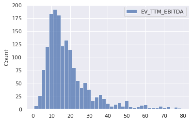
    


```python
sns.histplot(np.log(data_new[['EV_TTM_EBITDA']]))
```


    <matplotlib.axes._subplots.AxesSubplot at 0x7fab873cf828>


    
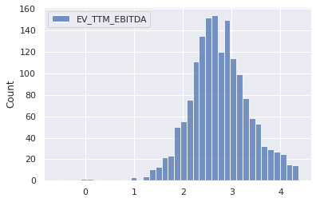
    


```python
sns.histplot(data_new[['EBITDA_Forecast_CAGR_10y']])
```


    <matplotlib.axes._subplots.AxesSubplot at 0x7fab87131080>


    
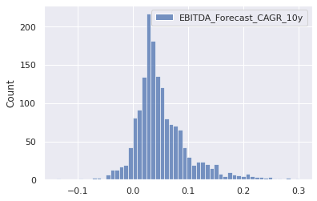
    


```python
sns.histplot(data[['Avg_EBITDA_Margin_Forecast_10y']])
```


    <matplotlib.axes._subplots.AxesSubplot at 0x7fab870eeda0>


    

    


```python
sns.histplot(data_new[['Beta_5y']])
```


    <matplotlib.axes._subplots.AxesSubplot at 0x7fab8704cef0>


    
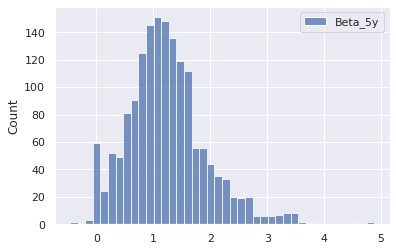
    


```python
sns.histplot(data_new[['Net_Debt_perc_Market_Cap']])
```


    <matplotlib.axes._subplots.AxesSubplot at 0x7fab86e87d30>


    
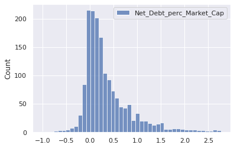
    


### 2.3 Split into training and testing set


```python
# split data into train and test splits
from sklearn.model_selection import train_test_split

X = data_new[['Sector', 'EBITDA_Forecast_CAGR_10y','Avg_EBITDA_Margin_Forecast_10y', 'Beta_5y', 'Net_Debt_perc_Market_Cap']];
Y = data_new[['EV_TTM_EBITDA']];
Y['Log_EV_TTM_EBITDA'] = np.log(Y['EV_TTM_EBITDA']);

X_train, X_test, Y_train, Y_test = train_test_split(X, Y, shuffle=True, test_size = 0.2, random_state=1);
```

    /usr/local/lib/python3.6/dist-packages/ipykernel_launcher.py:6: SettingWithCopyWarning: 
    A value is trying to be set on a copy of a slice from a DataFrame.
    Try using .loc[row_indexer,col_indexer] = value instead
    
    See the caveats in the documentation: https://pandas.pydata.org/pandas-docs/stable/user_guide/indexing.html#returning-a-view-versus-a-copy
      
    


```python
# check training data shape
print('X_train has shape', X_train.shape)
print('y_train has shape', Y_train.shape)
```

    X_train has shape (1303, 5)
    y_train has shape (1303, 2)
    


```python
#check X_train
X_train.head(5)
```


<div>
<style scoped>
    .dataframe tbody tr th:only-of-type {
        vertical-align: middle;
    }

    .dataframe tbody tr th {
        vertical-align: top;
    }

    .dataframe thead th {
        text-align: right;
    }
</style>
<table border="1" class="dataframe">
  <thead>
    <tr style="text-align: right;">
      <th></th>
      <th>Sector</th>
      <th>EBITDA_Forecast_CAGR_10y</th>
      <th>Avg_EBITDA_Margin_Forecast_10y</th>
      <th>Beta_5y</th>
      <th>Net_Debt_perc_Market_Cap</th>
    </tr>
    <tr>
      <th>Name</th>
      <th></th>
      <th></th>
      <th></th>
      <th></th>
      <th></th>
    </tr>
  </thead>
  <tbody>
    <tr>
      <th>Zimmer Biomet Holdings, Inc.</th>
      <td>Healthcare</td>
      <td>0.033462</td>
      <td>0.332755</td>
      <td>1.337184</td>
      <td>0.221408</td>
    </tr>
    <tr>
      <th>Allegiant Travel Company</th>
      <td>Industrials</td>
      <td>0.048457</td>
      <td>0.278896</td>
      <td>1.703256</td>
      <td>0.316869</td>
    </tr>
    <tr>
      <th>Alpha and Omega Semiconductor Limited</th>
      <td>Information Technology</td>
      <td>0.149025</td>
      <td>0.173992</td>
      <td>2.529411</td>
      <td>0.066703</td>
    </tr>
    <tr>
      <th>Zix Corporation</th>
      <td>Information Technology</td>
      <td>0.118027</td>
      <td>0.237929</td>
      <td>1.159138</td>
      <td>0.365729</td>
    </tr>
    <tr>
      <th>CMC Materials, Inc.</th>
      <td>Information Technology</td>
      <td>0.003157</td>
      <td>0.318449</td>
      <td>1.180672</td>
      <td>0.152127</td>
    </tr>
  </tbody>
</table>
</div>


```python
#check y_train
Y_train.head(5)
```


<div>
<style scoped>
    .dataframe tbody tr th:only-of-type {
        vertical-align: middle;
    }

    .dataframe tbody tr th {
        vertical-align: top;
    }

    .dataframe thead th {
        text-align: right;
    }
</style>
<table border="1" class="dataframe">
  <thead>
    <tr style="text-align: right;">
      <th></th>
      <th>EV_TTM_EBITDA</th>
      <th>Log_EV_TTM_EBITDA</th>
    </tr>
    <tr>
      <th>Name</th>
      <th></th>
      <th></th>
    </tr>
  </thead>
  <tbody>
    <tr>
      <th>Zimmer Biomet Holdings, Inc.</th>
      <td>20.932245</td>
      <td>3.041291</td>
    </tr>
    <tr>
      <th>Allegiant Travel Company</th>
      <td>49.358942</td>
      <td>3.899119</td>
    </tr>
    <tr>
      <th>Alpha and Omega Semiconductor Limited</th>
      <td>22.075878</td>
      <td>3.094486</td>
    </tr>
    <tr>
      <th>Zix Corporation</th>
      <td>14.757365</td>
      <td>2.691742</td>
    </tr>
    <tr>
      <th>CMC Materials, Inc.</th>
      <td>15.474569</td>
      <td>2.739198</td>
    </tr>
  </tbody>
</table>
</div>


```python
train_data = Y_train.merge(X_train, how='outer', left_index=True, right_index=True)
test_data = Y_test.merge(X_test, how='outer', left_index=True, right_index=True)
```

## 3. Exploratory Data Analysis

### 3.1 Summary Statistics


```python
train_data.describe().round(2)
```


<div>
<style scoped>
    .dataframe tbody tr th:only-of-type {
        vertical-align: middle;
    }

    .dataframe tbody tr th {
        vertical-align: top;
    }

    .dataframe thead th {
        text-align: right;
    }
</style>
<table border="1" class="dataframe">
  <thead>
    <tr style="text-align: right;">
      <th></th>
      <th>EV_TTM_EBITDA</th>
      <th>Log_EV_TTM_EBITDA</th>
      <th>EBITDA_Forecast_CAGR_10y</th>
      <th>Avg_EBITDA_Margin_Forecast_10y</th>
      <th>Beta_5y</th>
      <th>Net_Debt_perc_Market_Cap</th>
    </tr>
  </thead>
  <tbody>
    <tr>
      <th>count</th>
      <td>1303.00</td>
      <td>1303.00</td>
      <td>1303.00</td>
      <td>1303.00</td>
      <td>1303.00</td>
      <td>1303.00</td>
    </tr>
    <tr>
      <th>mean</th>
      <td>18.95</td>
      <td>2.75</td>
      <td>0.05</td>
      <td>0.26</td>
      <td>1.22</td>
      <td>0.37</td>
    </tr>
    <tr>
      <th>std</th>
      <td>13.21</td>
      <td>0.63</td>
      <td>0.05</td>
      <td>0.18</td>
      <td>0.69</td>
      <td>0.53</td>
    </tr>
    <tr>
      <th>min</th>
      <td>0.54</td>
      <td>-0.61</td>
      <td>-0.14</td>
      <td>0.00</td>
      <td>-0.47</td>
      <td>-1.03</td>
    </tr>
    <tr>
      <th>25%</th>
      <td>10.57</td>
      <td>2.36</td>
      <td>0.02</td>
      <td>0.13</td>
      <td>0.77</td>
      <td>0.03</td>
    </tr>
    <tr>
      <th>50%</th>
      <td>15.03</td>
      <td>2.71</td>
      <td>0.04</td>
      <td>0.21</td>
      <td>1.17</td>
      <td>0.21</td>
    </tr>
    <tr>
      <th>75%</th>
      <td>22.42</td>
      <td>3.11</td>
      <td>0.07</td>
      <td>0.35</td>
      <td>1.56</td>
      <td>0.55</td>
    </tr>
    <tr>
      <th>max</th>
      <td>79.29</td>
      <td>4.37</td>
      <td>0.28</td>
      <td>0.84</td>
      <td>4.88</td>
      <td>2.77</td>
    </tr>
  </tbody>
</table>
</div>


### 3.2 Correlation Matrix


```python
# correlation matrix for outcome variable

from string import ascii_letters
import numpy as np
import pandas as pd
import seaborn as sns
import matplotlib.pyplot as plt

sns.set_theme(style="white")

# Compute the correlation matrix
corr = train_data.drop(columns="Log_EV_TTM_EBITDA").corr()

# Generate a mask for the upper triangle
mask = np.triu(np.ones_like(corr, dtype=bool))

# Set up the matplotlib figure
f, ax = plt.subplots(figsize=(11, 9))

# Generate a custom diverging colormap
cmap = sns.diverging_palette(20, 230, as_cmap=True)

# Draw the heatmap with the mask and correct aspect ratio
sns.heatmap(corr, mask=mask, annot= True, cmap=cmap, vmax=.3, center=0,
            square=True, linewidths=.5, cbar_kws={"shrink": .5})
```


    <matplotlib.axes._subplots.AxesSubplot at 0x7fab86d66c18>


    
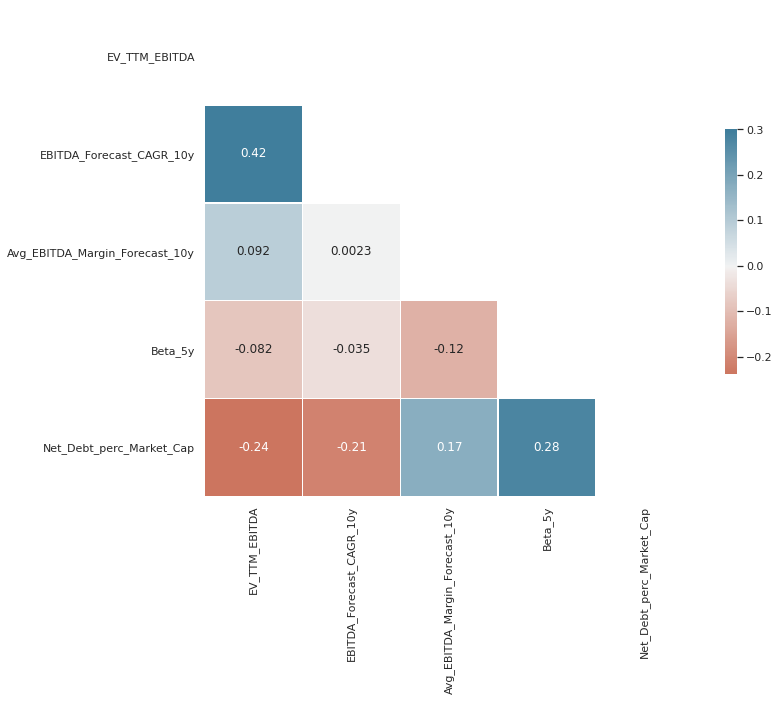
    


```python
# correlation matrix for log of outcome variable

# Compute the correlation matrix
corr = train_data.drop(columns="EV_TTM_EBITDA").corr()

# Generate a mask for the upper triangle
mask = np.triu(np.ones_like(corr, dtype=bool))

# Set up the matplotlib figure
f, ax = plt.subplots(figsize=(11, 9))

# Generate a custom diverging colormap
cmap = sns.diverging_palette(20, 230, as_cmap=True)

# Draw the heatmap with the mask and correct aspect ratio
sns.heatmap(corr, mask=mask, annot= True, cmap=cmap, vmax=.3, center=0,
            square=True, linewidths=.5, cbar_kws={"shrink": .5})
```


    <matplotlib.axes._subplots.AxesSubplot at 0x7fab86dcf208>


    
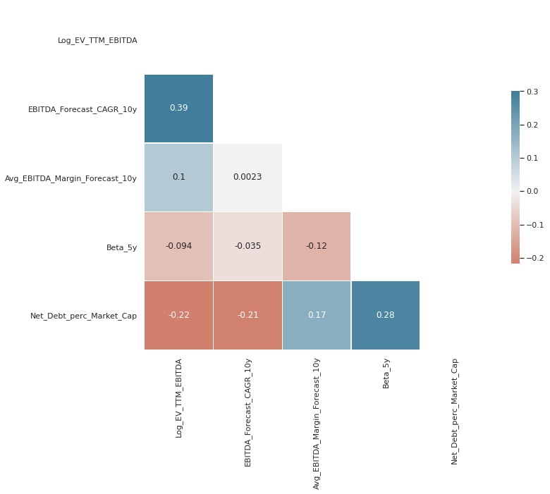
    


### 3.3 Pairplots


```python
sns.set_theme()
sns.jointplot(data=train_data, x="EBITDA_Forecast_CAGR_10y", y="EV_TTM_EBITDA")
sns.jointplot(data=train_data, x="EBITDA_Forecast_CAGR_10y", y="Log_EV_TTM_EBITDA")
```


    <seaborn.axisgrid.JointGrid at 0x7fab871d74e0>


    
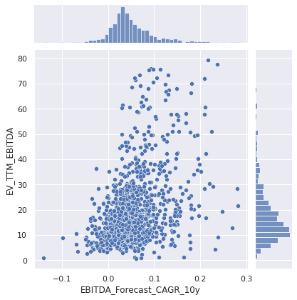
    


    
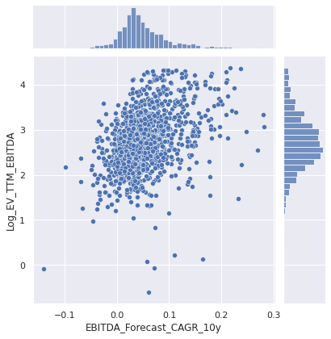
    


```python
sns.jointplot(data=train_data, x="Avg_EBITDA_Margin_Forecast_10y", y="EV_TTM_EBITDA")
sns.jointplot(data=train_data, x="Avg_EBITDA_Margin_Forecast_10y", y="Log_EV_TTM_EBITDA")
```


    <seaborn.axisgrid.JointGrid at 0x7fab868d17b8>


    
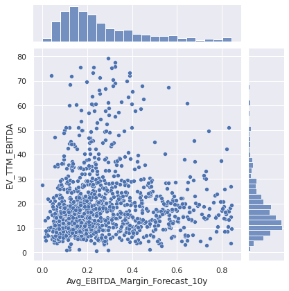
    


    
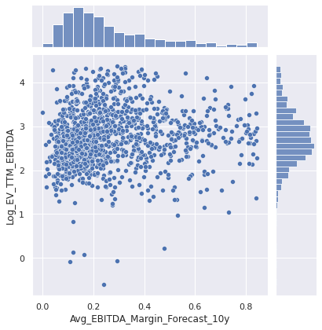
    


```python
sns.jointplot(data=train_data, x="Beta_5y", y="EV_TTM_EBITDA")
sns.jointplot(data=train_data, x="Beta_5y", y="Log_EV_TTM_EBITDA")
```


    <seaborn.axisgrid.JointGrid at 0x7fab865decc0>


    
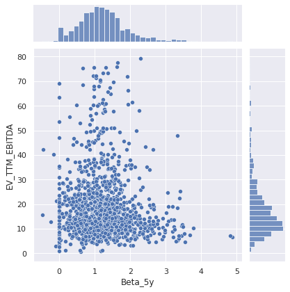
    


    
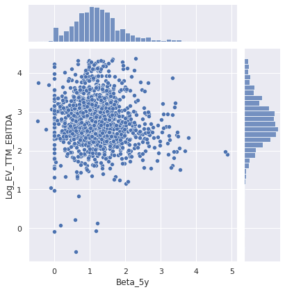
    


```python
sns.jointplot(data=train_data, x="Net_Debt_perc_Market_Cap", y="EV_TTM_EBITDA")
sns.jointplot(data=train_data, x="Net_Debt_perc_Market_Cap", y="Log_EV_TTM_EBITDA")
```


    <seaborn.axisgrid.JointGrid at 0x7fab86233ac8>


    
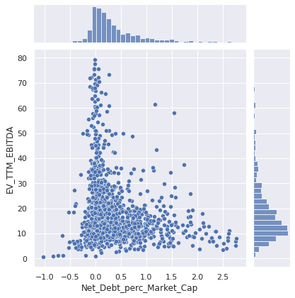
    


    
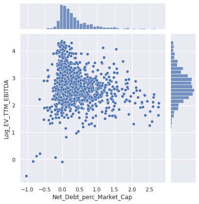
    


## 4. Machine Learning


```python
#ML dependancies

#data preprocessing pipeline to preprocess data table
from sklearn.pipeline import Pipeline
from sklearn.compose import ColumnTransformer
from sklearn.preprocessing import OneHotEncoder
from sklearn.preprocessing import MinMaxScaler
from sklearn.preprocessing import StandardScaler

#Grid search cross validation to find best hyper parameters
from sklearn.model_selection import GridSearchCV

#models considered
from sklearn.linear_model import Ridge
from sklearn.linear_model import Lasso
from sklearn.neighbors import KNeighborsRegressor
from sklearn.svm import SVR
from sklearn.tree import DecisionTreeRegressor
from sklearn.ensemble import RandomForestRegressor
from sklearn.ensemble import VotingRegressor

#evaluation
from sklearn.model_selection import cross_val_score
```

### 4.1 Pre-Processing Pipeline


```python
#split data back into X and y
X_train = train_data[['EBITDA_Forecast_CAGR_10y','Avg_EBITDA_Margin_Forecast_10y', 'Beta_5y', 'Net_Debt_perc_Market_Cap', 'Sector']]
y_train = train_data['Log_EV_TTM_EBITDA']

X_test = test_data[['EBITDA_Forecast_CAGR_10y','Avg_EBITDA_Margin_Forecast_10y', 'Beta_5y', 'Net_Debt_perc_Market_Cap', 'Sector']]
y_test = test_data['Log_EV_TTM_EBITDA']

# check training and test data shape
print('X_train has shape', X_train.shape)
print('y_train has shape', y_train.shape)
print('X_test has shape', X_test.shape)
print('y_test has shape', y_test.shape)
```

    X_train has shape (1303, 5)
    y_train has shape (1303,)
    X_test has shape (326, 5)
    y_test has shape (326,)
    


```python
# define categorical columns for transformation
categorical_variables = ['Sector']

# define numerical columns for transformation
numerical_variables = list(X_train.drop(columns=categorical_variables).columns)

# define column transformation for data preprocessing pipeline
column_transformer = ColumnTransformer(transformers=[
                                                 ('categorical_columns', OneHotEncoder(handle_unknown='ignore'), categorical_variables),
                                                 ('numeric_columns', StandardScaler(), numerical_variables)])
```

### 4.2 Model Training and Hyper Parameter Tuning


```python
#ridge regression

grid_values = {'model__alpha': [0.0001, 0.001, 0.01, 0.1, 1, 10, 100, 200, 300, 400, 500]}

model_1 = Pipeline([('column_transformer', column_transformer),
                    ('model', Ridge(max_iter = 100000))])

# default metric to optimize over grid parameters: accuracy
grid_model_1 = GridSearchCV(model_1, param_grid = grid_values, cv=5, scoring = 'r2')
grid_model_1 = grid_model_1.fit(X_train, y_train)

print('Grid best parameter: ', grid_model_1.best_params_)
print('Grid best score: ', grid_model_1.best_score_.round(3))
```

    Grid best parameter:  {'model__alpha': 10}
    Grid best score:  0.238
    


```python
#lasso regression

grid_values = {'model__alpha': [0.0001, 0.001, 0.01, 0.1, 1, 10, 100, 200, 300, 400, 500]}

model_2 = Pipeline([('column_transformer', column_transformer),
                    ('model', Lasso(max_iter = 100000))])

# default metric to optimize over grid parameters: accuracy
grid_model_2 = GridSearchCV(model_2, param_grid = grid_values, cv=5, scoring = 'r2')
grid_model_2 = grid_model_2.fit(X_train, y_train)

print('Grid best parameter: ', grid_model_2.best_params_)
print('Grid best score: ', grid_model_2.best_score_.round(3))
```

    Grid best parameter:  {'model__alpha': 0.001}
    Grid best score:  0.237
    


```python
#KNeighborsRegressor

grid_values = {'model__n_neighbors': [1, 3, 5, 7, 9, 11, 13, 15, 17, 19, 21, 23, 25]}

model_3 = Pipeline([('column_transformer', column_transformer),
                    ('model', KNeighborsRegressor())])

# default metric to optimize over grid parameters: accuracy
grid_model_3 = GridSearchCV(model_3, param_grid = grid_values, cv=5, scoring = 'r2')
grid_model_3 = grid_model_3.fit(X_train, y_train)

print('Grid best parameter: ', grid_model_3.best_params_)
print('Grid best score: ', grid_model_3.best_score_.round(3))
```

    Grid best parameter:  {'model__n_neighbors': 9}
    Grid best score:  0.286
    


```python
#SVR linear

grid_values = {'model__C': [0.01, 0.1, 1, 10, 100]}

model_4 = Pipeline([('column_transformer', column_transformer),
                    ('model', SVR(kernel='linear'))])

# default metric to optimize over grid parameters: accuracy
grid_model_4 = GridSearchCV(model_4, param_grid = grid_values, cv=5, scoring = 'r2')
grid_model_4 = grid_model_4.fit(X_train, y_train)

print('Grid best parameter: ', grid_model_4.best_params_)
print('Grid best score: ', grid_model_4.best_score_.round(3))
```

    Grid best parameter:  {'model__C': 0.1}
    Grid best score:  0.233
    


```python
#SVR rbf

grid_values = {'model__gamma': [0.01, 0.1, 1, 10, 100], 
               'model__C': [0.01, 0.1, 1, 10, 100]}

model_5 = Pipeline([('column_transformer', column_transformer),
                    ('model', SVR(kernel='rbf'))])

# default metric to optimize over grid parameters: accuracy
grid_model_5 = GridSearchCV(model_5, param_grid = grid_values, cv=5, scoring = 'r2')
grid_model_5 = grid_model_5.fit(X_train, y_train)

print('Grid best parameter: ', grid_model_5.best_params_)
print('Grid best score: ', grid_model_5.best_score_.round(3))
```

    Grid best parameter:  {'model__C': 10, 'model__gamma': 0.1}
    Grid best score:  0.339
    


```python
#DecisionTreeRegressor

grid_values = {'model__max_depth': [2, 3, 4, 5, 6, 7, 8]}

model_6 = Pipeline([('column_transformer', column_transformer),
                    ('model', DecisionTreeRegressor())])

# default metric to optimize over grid parameters: accuracy
grid_model_6 = GridSearchCV(model_6, param_grid = grid_values, cv=5, scoring = 'r2')
grid_model_6 = grid_model_6.fit(X_train, y_train)

print('Grid best parameter: ', grid_model_6.best_params_)
print('Grid best score: ', grid_model_6.best_score_.round(3))
```

    Grid best parameter:  {'model__max_depth': 5}
    Grid best score:  0.291
    


```python
#RandomForestRegressor

grid_values = {'model__max_depth': [2, 3, 4, 5, 6, 7, 8, 9, 10], 
               'model__n_estimators': [50, 75, 100, 125, 150, 200, 250]}

model_7 = Pipeline([('column_transformer', column_transformer),
                    ('model', RandomForestRegressor())])

# default metric to optimize over grid parameters: accuracy
grid_model_7 = GridSearchCV(model_7, param_grid = grid_values, cv=5, scoring = 'r2')
grid_model_7 = grid_model_7.fit(X_train, y_train)

print('Grid best parameter: ', grid_model_7.best_params_)
print('Grid best score: ', grid_model_7.best_score_.round(3))
```

    Grid best parameter:  {'model__max_depth': 9, 'model__n_estimators': 100}
    Grid best score:  0.424
    


```python
#VotingRegressor

model_8 = VotingRegressor([('ridge', grid_model_1), ('lasso', grid_model_2), ('knn', grid_model_3), ('svr_linear', grid_model_4), 
                                     ('svr_rbf', grid_model_5), ('tree', grid_model_6), ('rf', grid_model_7)])
model_8 = model_8.fit(X_train, y_train)
cv_score = cross_val_score(model_8, X_train, y_train, cv=5, scoring = 'r2').mean().round(3)
print('CV score', cv_score)
```

    CV score 0.363
    

### 4.3 Model Comparison and Selection


```python
#model performance summary on cross validation folds

models = ['Ridge', 
          'Lasso',
          'KNeighborsRegressor',
          'SVR linear',
          'SVR rbf',
          'Decision Tree',
          'RandomForestRegressor', 
          'VotingRegressor']

scores = [grid_model_1.best_score_.round(3),
          grid_model_2.best_score_.round(3),
          grid_model_3.best_score_.round(3),
          grid_model_4.best_score_.round(3),
          grid_model_5.best_score_.round(3),
          grid_model_6.best_score_.round(3),
          grid_model_7.best_score_.round(3), 
          cv_score.round(3)]

model_scores = pd.DataFrame(data= scores, columns = ['CV_r2'], index = models)
print('The average cross validation performance of all trained models was as below')
model_scores
```

    The average cross validation performance of all trained models was as below
    


<div>
<style scoped>
    .dataframe tbody tr th:only-of-type {
        vertical-align: middle;
    }

    .dataframe tbody tr th {
        vertical-align: top;
    }

    .dataframe thead th {
        text-align: right;
    }
</style>
<table border="1" class="dataframe">
  <thead>
    <tr style="text-align: right;">
      <th></th>
      <th>CV_r2</th>
    </tr>
  </thead>
  <tbody>
    <tr>
      <th>Ridge</th>
      <td>0.238</td>
    </tr>
    <tr>
      <th>Lasso</th>
      <td>0.237</td>
    </tr>
    <tr>
      <th>KNeighborsRegressor</th>
      <td>0.286</td>
    </tr>
    <tr>
      <th>SVR linear</th>
      <td>0.233</td>
    </tr>
    <tr>
      <th>SVR rbf</th>
      <td>0.339</td>
    </tr>
    <tr>
      <th>Decision Tree</th>
      <td>0.291</td>
    </tr>
    <tr>
      <th>RandomForestRegressor</th>
      <td>0.424</td>
    </tr>
    <tr>
      <th>VotingRegressor</th>
      <td>0.363</td>
    </tr>
  </tbody>
</table>
</div>


```python
#get the best model as per cross validation performance
print('The model selected with the best Cross Validation performance was:', model_scores.index[np.argmax(model_scores['CV_r2'])])
model_scores.iloc[[np.argmax(model_scores['CV_r2'])]]
```

    The model selected with the best Cross Validation performance was: RandomForestRegressor
    


<div>
<style scoped>
    .dataframe tbody tr th:only-of-type {
        vertical-align: middle;
    }

    .dataframe tbody tr th {
        vertical-align: top;
    }

    .dataframe thead th {
        text-align: right;
    }
</style>
<table border="1" class="dataframe">
  <thead>
    <tr style="text-align: right;">
      <th></th>
      <th>CV_r2</th>
    </tr>
  </thead>
  <tbody>
    <tr>
      <th>RandomForestRegressor</th>
      <td>0.424</td>
    </tr>
  </tbody>
</table>
</div>


### 4.4 Out of Sample Performance Estimation


```python
#model dictionary
model_dict = {'Ridge': grid_model_1,
              'Lasso': grid_model_2,
              'KNeighborsRegressor': grid_model_3,
              'SVR linear': grid_model_4,
              'SVR rbf': grid_model_5,
              'Decision Tree': grid_model_6,
              'RandomForestRegressor': grid_model_7, 
              'VotingRegressor': model_8
              }
```


```python
#test set performance best models
print('The best model reaches below out of sample test set performance:')
model_dict[model_scores.index[np.argmax(model_scores['CV_r2'])]].score(X_test, y_test).round(3)
```

    The best model reaches below out of sample test set performance:
    


    0.473


